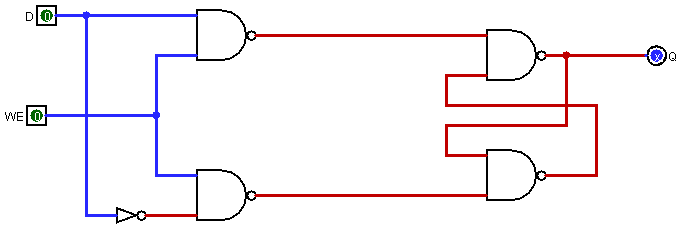
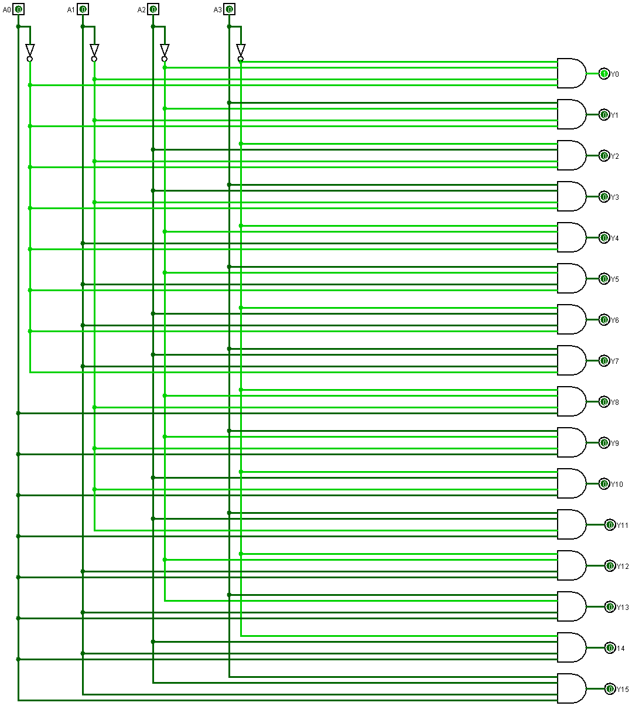
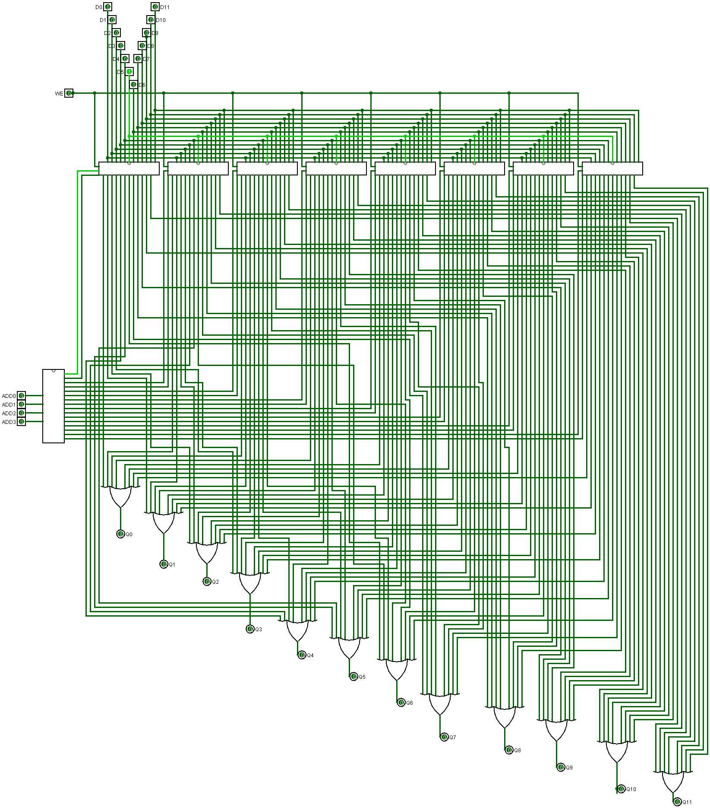
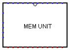

# 16x12 Memory Unit Logic Design Using Logisim
A memory unit is a small storage device that holds a memory for a computer and can be accessed through software. Memory units are typically used to store the information of the programs.

We aim to desing a **16 rows, 12 bit wide** Memory unit as logic design level using logisim.

## Prerequisites
 - [JDK](https://www.oracle.com/java/technologies/downloads/) - Any version
 - [Logisim](http://www.cburch.com/logisim/) - Desktop application

## How to work?

Once you install JDK & download Logisim, open the application and click on the file menu then open. Choose the file Memory.circ.

## Project Files
 - **BIT:** Gated SR Latch is considered the main/basic unit of memory. It is responsible for read/write operations for one bit.  It can only change its output state when there is an enabling signal along with the required inputs. 

 - **2x12 MEM:** It is a small memory unit that organizes BIT in form of 2 rows, 12-bit wide (columns). It is responsible for read/write operations.

 - **4x16 DEC:** A 4x16 decoder circuit is used to transform a four digits input signal into an equivalent decimal code. 

 - **MEM UNIT:** The final component with all parts attached. It tasks a flag bin as a WE signal, 4 bins as an address, and 12 bins as data. It gives back 12 bins as output based on the operation "read/write". 

 - **main:** A page that contains the memory as one block, is used for development and testing purposes. 